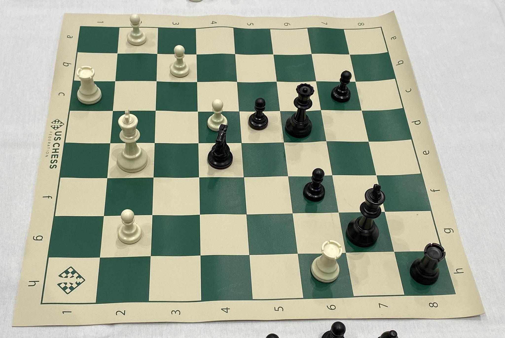
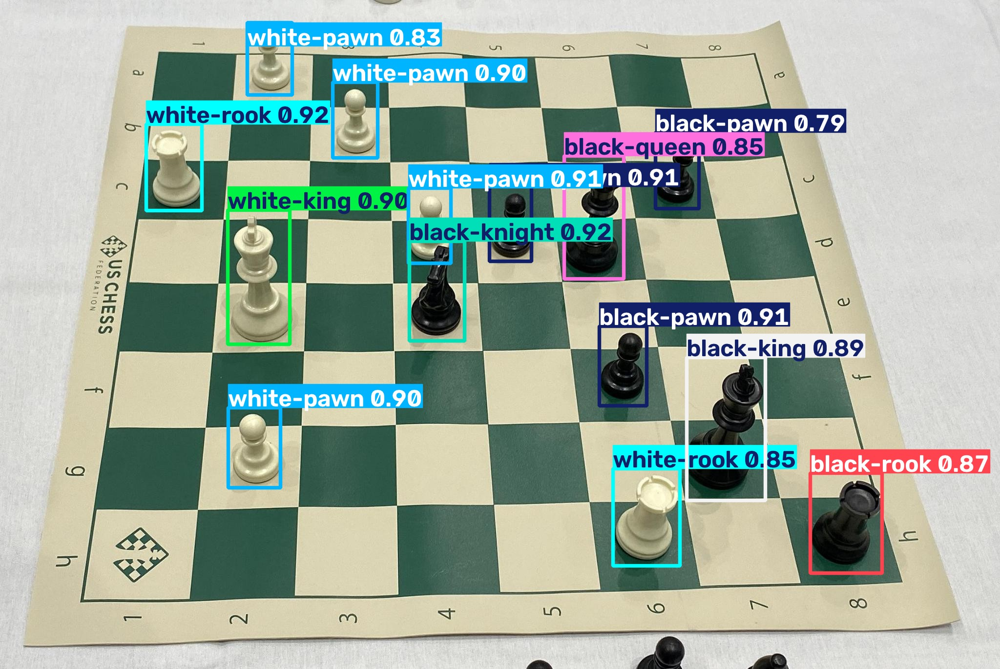
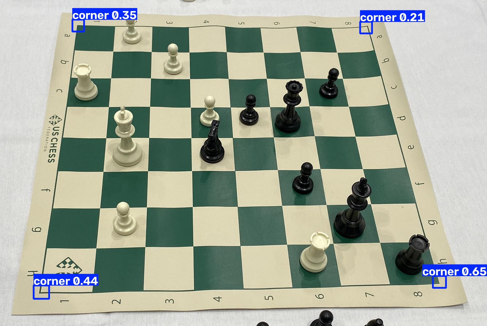
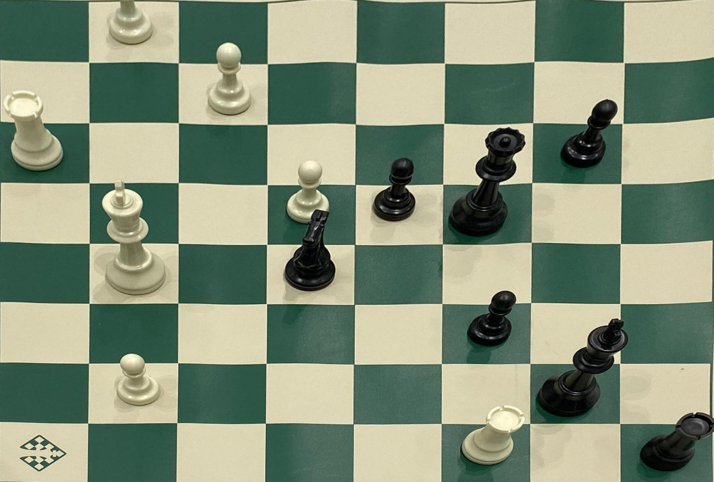
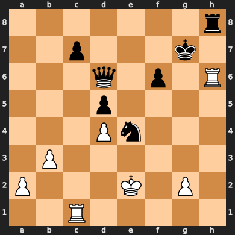

# PhotoChess


Authors: 

[Gabriele Ceccolini @Gabrocecco](https://github.com/Gabrocecco)

[Rocco Pastore @roccopastore](https://github.com/roccopastore)

[Giacomo Grilli @jackman91798](https://github.com/jackman91798)


### ☑ Training of the Object detector model (YOLO) on the reference dataset

### ☑ Localization and classification of the pieces on the board starting from the output of the trained model

### ☑ Porting the position into a digital representation of the board

### ☑ Integration on Android application for position analysis via chess engine via external API

## How it works

A photo of a physical chessboard is turned into a FEN string (and from there, into engine analysis) in five steps. The images below are real output from the pipeline (`photochess/`) running on one of the test photos.

**1. Original photo** — a picture of the board taken from an angle, exactly as the app receives it from the camera.



**2. Piece detection** — a YOLOv8 model detects every piece on the *original, unwarped* photo and classifies it by type and color. Detecting before warping is intentional: pieces are tall 3D objects, and warping the image first would distort them.



**3. Corner detection** — a second YOLOv8 model locates the board's 4 corners, used to compute the perspective transform.



**4. Bird's-eye warp** — a homography built from the 4 corners warps the photo into a top-down view, and each piece detection is projected into that same view.



**5. Digital board** — each projected piece is snapped to the nearest of the 64 squares, producing a FEN string. From there, [python-chess](https://python-chess.readthedocs.io/) renders the digital board and an engine can analyze the position.



```
7r/2p3k1/3q1p1R/3p4/3Pn3/1P6/P3K1P1/2R5 w KQkq - 0 1
```

On Android, the same Python pipeline (via [Chaquopy](https://chaquo.com/chaquopy/)) runs on-device: take a photo, confirm it, and the app returns the position, best move, and evaluation.
